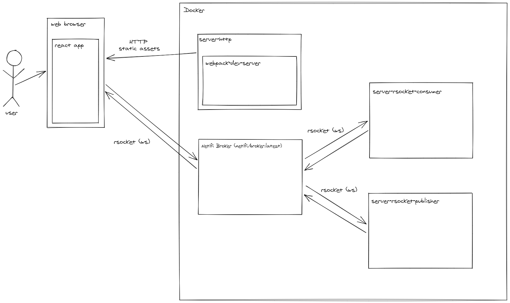

# netifi-rsocket-js-example
Example application(s) for utilizing the netifi rsocket gateway and rsocket-js (client &amp; server).

# Work in progress

This repository is a work in progress, and once it is less so this README will contain more details.

# Docker

Run the example(s) using docker-compose

```
docker-compose up
```

# Architecture Overview

Made with [https://excalidraw.com/](https://excalidraw.com/)


